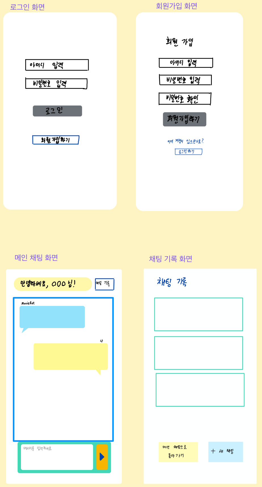

영화요약 및 추천 챗봇
========================
## 📝 프로젝트 설명
특정 영화를 요약하거나, 비슷한 장르의 영화를 추천해주는 ChatGPT API를 활용한 웹 애플리케이션입니다.

## 🚀 주요 기능
- **회원 관리** 
    - 회원가입 / 로그인 / 로그아웃 (`/register`, `/login`, `/logout`)
    - 사용자별 대화 세션 관리

- **챗봇과 대화 및 대화내용 저장**
    - 영화 추천, 요약 등 (`/chat`)
    - 대화 기록 저장
    - 대화내용 확인 가능 (`/chat/history`)

## 🛠 기술 스택
| 구분 | 기술 |
|------|------|
| Backend | FastAPI, Uvicorn, Pydantic, Python |
| Frontend | HTML, CSS, JavaScript |
| External API | ChatGPT API |
| Development & Tools | Uvicorn, Git, GitHub, Postman |

## 📂 프로젝트 구조
```
📦 project/
├─ 📂 back/
│  ├─ 🐍 auth.py
│  ├─ 🐍 chatgpt_api.py
│  ├─ 🐍 main.py
│  └─ 🐍 models.py
├─ 📂 front/
│  ├─ 🌐 chat.html
│  ├─ 🌐 history.html
│  ├─ 🌐 login.html
│  ├─ 🌐 register.html
│  ├─ 📜 scripts.js
│  └─ 🎨 styles.css
├─ 📂 images/
│  └─ 🖼️ wireframe_01.png
├─ 📝 README.md
└─ 📄 requirements.txt
```

## 🗂️ WBS(Work Breakdown Structure)
```
1. 프로젝트 준비
- 요구사항 정의
    - 영화 요약 기능
    - 비슷한 장르 영화 추천 기능
    - 회원가입/로그인 및 유저별 질문/답변 저장 기능
- 기술 스택 선정
    - 백엔드
    - 프론트엔드
    - 외부: ChatGPT API
- 외부 API 상세 정의
    - ChatGPT API 요청 형식, 파라미터, 응답 구조

2. 백엔드 개발 (FastAPI)
- 개발환경 설정
    - 가상환경 구성
- 질문/답변 API 개발
    - 질문 수신 처리 (POST)
    - ChatGPT API 호출
    - 응답 반환
- 유저 관리
    - 회원가입/로그인
    - 유저별 질문/답변
- CORS 설정

3. 프론트엔드 개발
- HTML 구조 설계
- CSS 디자인
- JavaScript 기능 구현

4. 테스트
- 단위 테스트
    - 질문/답변 API 테스트
    - 로그인/회원가입 테스트
    - 화면 출력 테스트
    - CORS 정상 동작 테스트
- 통합 테스트
    - 프론트엔드와 백엔드 연동 테스트 (Fetch API → FastAPI → ChatGPT 응답)

5. 배포 및 발표
- 배포 준비
- 문서화
    - 기능 설명, API 사용법, 실행 방법 등 포함
- README 정리
- 제출
```

## 🖼️ 와이어프레임


## ⚡ 설치 및 실행 방법
### 1. 레포지토리 클론
```bash
git clone https://github.com/nockbeet/modu_first_project.git
cd modu_first_project
```

### 2. 가상환경 생성 및 활성화
```bash
# Windows
python -m venv venv
venv\Scripts\activate

# Mac / Linux
python3 -m venv venv
source venv/bin/activate
```

### 3. 의존성 설치
```bash
pip install -r requirements.txt
```
프로젝트 내에 `requirements.txt` 파일이 없으면 직접 설치해야 합니다.

### 4. 서버 실행
```bash
cd back
uvicorn main:app --reload
```

### 5. 브라우저 접속
`http://127.0.0.1:8000`에 접속하면, 로그인 화면을 확인할 수 있습니다.